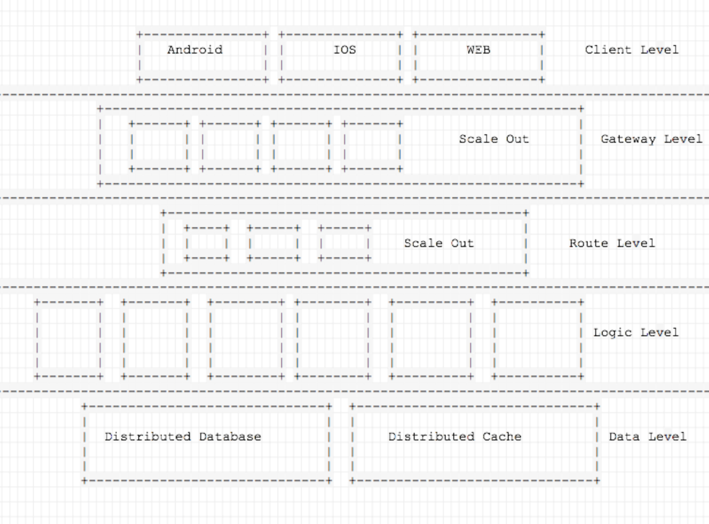

# Coding ...

## 系统架构

- [asciiflow](http://asciiflow.com) 作图

分成多层架构的作用就是使整个系统中的各个模块互相之间解藕，模块处理简单化

### 客户端

根据不同的客户端实现不同网络接口，通过HTTP向网关层对外的负载均衡服务器获取最佳的网关层服务器IP地址列表，随机在获取的IP地址列表中选择一个网关层服务器地址连接，直至连接成功，并采用应用心跳保活

### 网关层

实现不同客户端接入，对外提供接入的负载均衡模块（Robin, 最少连接等），可以根据IP地址等设置黑名单，安全检查，这层的主要功能是承担大量客户端接入，属于IO密集型，所以这部分只处理简单的计算任务，将客户端发来的请求发至到路由层不做过多的数据包的解析

### 路由层

主要的作用是数据的路由分发，接收网关层发来的数据包，通过识别包的头部数据中的服务类型字段server来把数据包发送至逻辑层中不同的服务模块

### 逻辑层

根据不同逻辑拆分成不同服务模块（用户模块，用户关系模块，消息模块等），是整个系统的逻辑处理模块属于计算密集型，由下层的数据层提供各个模块的数据来源

### 数据层

采用分布式存储的方式(TiDB, CockroachDB等)存储整个系统的状态数据，并提供实现数据的持久化，同时提供热点数据的缓存(Codis)实现高效的数据获取

－ 由于采用无状态(Stateless)设计，所以可以根据需求动态的调整服务器数量，做到高可用，高可扩展。

## 计划表

1. 数据持久层使用分布式数据库TiDB/CockroachDB替换单点数据库MySQL.
2. 先完成android版移动端.
3. 后续完成整个对系统的监控.
4. ...
